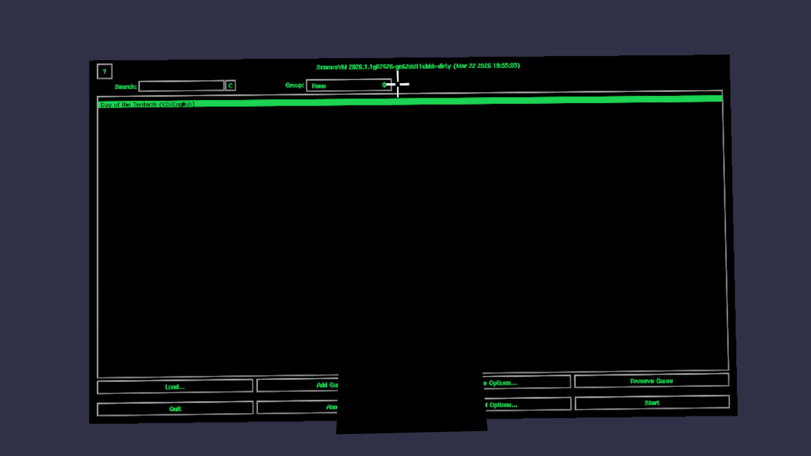

# ScummVR

Play classic point-and-click adventure games in VR on your Meta Quest. Your games appear on a big floating screen in a dark virtual cinema, and you point and click with your Quest controller.

<p align="center">
  
</p>

> **Note:** This has only been tested on a Meta Quest 2. It should work on Quest 3 and Quest Pro but this hasn't been confirmed yet.

<p align="center">
  
</p>

## Install (5 minutes)

You need a USB cable and a computer with ADB installed.

- **Windows:** Download [Android Platform Tools](https://developer.android.com/tools/releases/platform-tools#downloads), unzip it, and open a Command Prompt in that folder
- **Mac:** `brew install android-platform-tools`
- **Linux:** `sudo apt install adb`

### Step 1: Enable Developer Mode on your Quest

1. Install the **Meta Quest app** on your phone
2. Go to **Menu → Devices → Developer Mode → On**
3. Restart your Quest

### Step 2: Install ScummVR

1. Download **[ScummVM-VR.apk](ScummVM-VR.apk)** from this repo
2. Connect your Quest to your computer with a USB cable
3. Put on the headset and tap **Allow** when asked about USB debugging
4. On your computer, run:
   ```
   adb install ScummVM-VR.apk
   ```

### Step 3: Add a game

Copy your game files to the Quest:
```
adb push /path/to/my-game/ /sdcard/scummvm_games/my-game/
```

For example, if you have Day of the Tentacle:
```
adb push ~/games/dott/ /sdcard/scummvm_games/dott/
```

### Step 4: Play!

1. On your Quest, go to **Apps → Unknown Sources → ScummVM VR**
2. Point at **Add Game** and pull the trigger
3. Browse to your game folder and select it
4. Hit **Start**

### Using Steam games

If you own classic adventure games on Steam, the game files are already on your PC. Just find them and push them to the Quest:

**Windows:**
```
adb push "C:\Program Files\Steam\steamapps\common\Day of the Tentacle Remastered" /sdcard/scummvm_games/dott/
adb push "C:\Program Files\Steam\steamapps\common\Indiana Jones and the Fate of Atlantis" /sdcard/scummvm_games/indy4/
adb push "C:\Program Files\Steam\steamapps\common\The Dig" /sdcard/scummvm_games/dig/
```

**Linux:**
```
adb push ~/.steam/steam/steamapps/common/Day\ of\ the\ Tentacle\ Remastered/ /sdcard/scummvm_games/dott/
adb push ~/.steam/steam/steamapps/common/Full\ Throttle\ Remastered/ /sdcard/scummvm_games/throttle/
adb push ~/.steam/steam/steamapps/common/Sam\ \&\ Max\ Hit\ the\ Road/ /sdcard/scummvm_games/samnmax/
```

**macOS:**
```
adb push ~/Library/Application\ Support/Steam/steamapps/common/Day\ of\ the\ Tentacle\ Remastered/ /sdcard/scummvm_games/dott/
```

ScummVM knows how to read the data files from both the original and remastered editions. You don't need the Steam executable — just the game data files.

### Free games to try

- [Beneath a Steel Sky](https://www.scummvm.org/games/#games-bass) — free download
- [Flight of the Amazon Queen](https://www.scummvm.org/games/#games-queen) — free download
- [Lure of the Temptress](https://www.scummvm.org/games/#games-lure) — free download

## Controls

| Controller | Action |
|---|---|
| **Right controller** point | Move cursor |
| **Right trigger** | Left click |
| **Right grip** | Right click |
| **B button** | ESC (skip cutscene, open menu) |
| **Left thumbstick** | Scroll up/down |
| **Head movement** | Look around |

## Current limitations

- Only SCUMM engine games (LucasArts adventures) are included in this build — Monkey Island, Day of the Tentacle, Indiana Jones, Sam & Max, Full Throttle, The Dig, etc.
- Only tested on Quest 2
- No hand tracking yet (controllers only)
- Theme files not loaded (the UI looks basic but works fine)

## Building from source

<details>
<summary>Click to expand build instructions</summary>

### Prerequisites

- Linux (tested on Ubuntu 25.10)
- Android SDK and NDK 23.2.8568313
- Java 17 JDK
- CMake

### Build dependencies

```bash
export ANDROID_SDK_ROOT=$HOME/android-sdk
export ANDROID_NDK_ROOT=$HOME/android-sdk/ndk/23.2.8568313

# OpenXR loader
git clone --depth 1 https://github.com/KhronosGroup/OpenXR-SDK.git
cd OpenXR-SDK && mkdir build-android && cd build-android
cmake .. \
  -DCMAKE_TOOLCHAIN_FILE=$ANDROID_NDK_ROOT/build/cmake/android.toolchain.cmake \
  -DANDROID_ABI=arm64-v8a -DANDROID_PLATFORM=android-29 \
  -DANDROID_STL=c++_shared -DBUILD_TESTS=OFF -DBUILD_API_LAYERS=OFF
make -j$(nproc) openxr_loader
cd ../..

# libogg
git clone --depth 1 https://github.com/xiph/ogg.git
cd ogg && mkdir build-android && cd build-android
cmake .. -DCMAKE_TOOLCHAIN_FILE=$ANDROID_NDK_ROOT/build/cmake/android.toolchain.cmake \
  -DANDROID_ABI=arm64-v8a -DANDROID_PLATFORM=android-21 \
  -DCMAKE_INSTALL_PREFIX=$HOME/android-libs -DBUILD_SHARED_LIBS=OFF
make -j$(nproc) install && cd ../..

# libvorbis (for voice acting in games)
git clone --depth 1 https://github.com/xiph/vorbis.git
cd vorbis && mkdir build-android && cd build-android
cmake .. -DCMAKE_TOOLCHAIN_FILE=$ANDROID_NDK_ROOT/build/cmake/android.toolchain.cmake \
  -DANDROID_ABI=arm64-v8a -DANDROID_PLATFORM=android-21 \
  -DCMAKE_INSTALL_PREFIX=$HOME/android-libs -DBUILD_SHARED_LIBS=OFF \
  -DOGG_INCLUDE_DIR=$HOME/android-libs/include \
  -DOGG_LIBRARY=$HOME/android-libs/lib/libogg.a -DBUILD_TESTING=OFF
make -j$(nproc) install && cd ../..
```

### Build ScummVR

```bash
# Configure (use --enable-all-engines for all 2000+ supported games)
CXXFLAGS="-I$HOME/android-libs/include" \
LDFLAGS="-L$HOME/android-libs/lib" \
LIBS="-lvorbisfile -lvorbis -logg" \
./configure --host=android-arm64-v8a --enable-openxr --enable-vorbis \
  --disable-all-engines --enable-engine=scumm

# Add OpenXR paths to config.mk
cat >> config.mk << 'EOF'
OPENXR_CFLAGS := -I$(HOME)/OpenXR-SDK/include
OPENXR_LIBS := -L$(HOME)/OpenXR-SDK/build-android/src/loader -lopenxr_loader
CXXFLAGS += $(OPENXR_CFLAGS)
LIBS += $(OPENXR_LIBS)
LIBS += -lGLESv3
EOF

# Build
make -j$(nproc)

# Set up VR APK project
mkdir -p android_project_vr/lib/arm64-v8a
cp android_project/lib/arm64-v8a/libscummvm.so android_project_vr/lib/arm64-v8a/
cp OpenXR-SDK/build-android/src/loader/libopenxr_loader.so android_project_vr/lib/arm64-v8a/
cp $ANDROID_NDK_ROOT/sources/cxx-stl/llvm-libc++/libs/arm64-v8a/libc++_shared.so android_project_vr/lib/arm64-v8a/

# Copy Gradle project files
cp -r android_project/gradle android_project_vr/
cp android_project/gradlew android_project_vr/
cp android_project/settings.gradle android_project_vr/
cp android_project/gradle.properties android_project_vr/
cp -r android_project/mainAssets android_project_vr/
echo "sdk.dir=$ANDROID_SDK_ROOT" > android_project_vr/local.properties
echo "srcdir=$(pwd)" > android_project_vr/src.properties
cp dists/android-vr/build.gradle android_project_vr/

# Build APK
cd android_project_vr && ./gradlew assembleDebug

# Install
adb install build/outputs/apk/debug/ScummVM-debug.apk
```

</details>

## How it works

ScummVM runs on a background thread and renders to a shared OpenGL texture. A VR main loop powered by OpenXR displays that texture on a virtual screen quad, rendered once per eye with head tracking. Quest controller aim is converted to mouse position via ray-plane intersection.

## License

GNU General Public License v3.0 (same as [ScummVM](https://www.scummvm.org/)).

## Credits

- [ScummVM](https://www.scummvm.org/) — the engine reimplementation project that makes all of this possible
- [OpenXR](https://www.khronos.org/openxr/) — VR/AR API standard by the Khronos Group
- [quest_xr](https://github.com/cshenton/quest_xr) — minimal Quest OpenXR reference that helped get this working
- Built with [Claude Code](https://claude.ai/code)
